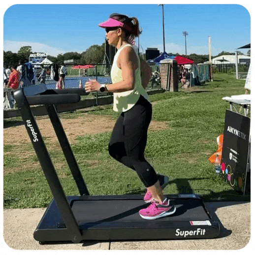

# How to Record Running Videos for AI-Powered Analysis: A Step-by-Step Guide

AI-powered video analysis and gait biomechanics require proper motion capture for accuracy. To get the best insights on running form, injury prevention, and progress tracking, follow this step-by-step guide for optimal video recording.\
\
1\. Set Up the Right Recording Conditions

**AiKYNETIX** supports both **indoor** and **outdoor video capture** for running analysis. Indoor recordings typically refer to treadmill sessions, while outdoor recordings involve tracking a runner in an open space. This guide focuses exclusively on running—not walking or jogging—since proper running mechanics involve multiple airborne phases, typically achieved at running speeds (check mph guidelines).

**Key Considerations for Indoor vs. Outdoor Recording**

* **Indoor Challenges:** The most common issue is gym recordings where other people appear in the background. This should be avoided to ensure clear motion tracking.
* **Outdoor Challenges:** The primary difficulty is maintaining a consistent camera angle as the runner moves.

**Recording Methods**

* **Assisted Recording:** Someone holds the phone and tracks the runner as they pass the camera.
* **Self-Recording: Outdoor:** Use a rotational pod to keep the camera focused on the runner. **Indoor (Treadmill):** Use a standard tripod for stability.

_📌 **Tip:** For indoor treadmill recordings, enable a 10-second countdown timer before starting. This feature is available in the **AiKYNETIX app** settings or any smartphone video mode._

<figure><figcaption>
<strong>A stable camera setup is essential for clear, precise motion tracking.</strong>
</figcaption></figure>

#### 2. Use the Right Recording Equipment

* **Minimize Background Distractions** – Avoid moving objects, crowds, or reflective surfaces to ensure the AI accurately isolates the runner’s motion.
* **Optimize Lighting** – Avoid harsh shadows, glare, or dim conditions. Use natural light or evenly distributed artificial lighting.
* **Avoid windy or rainy conditions**, as they can interfere with both your running and the video clarity.
* **Choose the Right Camera** – While both front (selfie) and back cameras can be used, the back camera is recommended for higher video quality. **Camera:** Any high-resolution camera (minimum 1080p with 30 fps or higher) will ensure smooth capture of fast movements.

<figure><figcaption>
<strong>Proper recording conditions ensure the most accurate motion tracking and analysis.</strong>
</figcaption></figure>

#### 3. Optimal Camera Positioning for Running Analysis

* **Camera Height:** Position at hip or chest level for accurate motion tracking.
* **Maintain Distance:** Ensure the entire body is visible in the frame. Exact distance may vary, but aim for a clear and unobstructed view.
* **Camera Stability:** Use a tripod, rotational pod, or hold the phone by hand to keep the runner in focus.
* **Best Angle:** Film perpendicular to the runner’s movement to avoid distortions in gait and stride analysis.

_📌 **Illustration Purpose Only** – The image provided serves as a visual guide and does not require exact measurements._\

<figure><figcaption>
<strong>Side-angle positioning allows accurate stride length, cadence, and ground contact analysis.</strong>
</figcaption></figure>

#### 4. Athlete’s Running Form & Attire

For the most accurate results:

* **Run in a straight line**, parallel to the camera. Avoid sudden turns or changes in pace.
* **The person should be running, not walking!**
* For running analysis, **the video should be under a minute, ideally around 30 seconds** to ensure the AI captures a full gait cycle.
* **Wear tight-fitting, contrast-colored clothing** (e.g., leggings and a tank top) to clearly define body contours. Avoid loose clothing, which can obscure key points.

<figure><figcaption>
<strong>Proper attire helps AI recognize joint positions and body movement with precision.</strong>
</figcaption></figure>

#### 5. Optimize Video Quality for AI Analysis

* **Save your video in a widely supported format** (MP4, MOV).
* **Trim excess footage** to start and end with full strides for clean data processing.
* **Avoid excessive compression**, as it can reduce the clarity of joint tracking.

<figure><figcaption>
<strong>High-quality video ensures precise motion tracking and biomechanics analysis.</strong>
</figcaption></figure>
