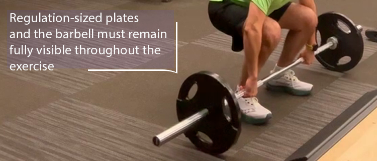
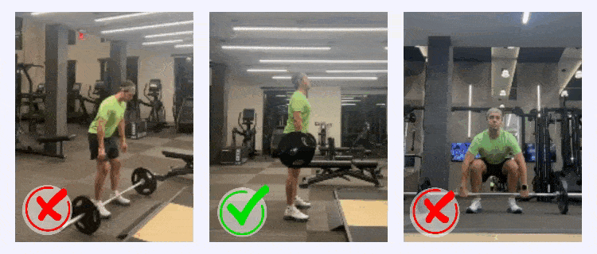
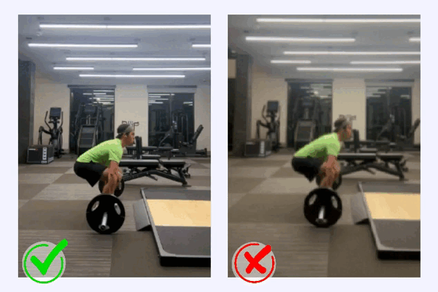

# How to Record Weightlifting Workouts Accurately with the AiKYNETIX App

> Recording your weightlifting workouts accurately is essential for effective performance analysis and progress tracking. The AiKYNETIX app, powered by advanced computer vision, biomechanics, and AI, ensures precise metrics if videos are recorded under optimal conditions. Below are comprehensive guidelines to help you get the best results.

#### Equipment and Exercises

The AiKYNETIX weightlifting module tracks exercises such as clean, snatch, and clean & jerks performed with barbells and circular plates. While it excels in analyzing movements with standard plates, non-circular plates, dumbbells, kettlebells, and bodyweight exercises are not yet supported for automated tracking.Ensure your equipment meets the following criteria:

* Circular Plates: Regulation-sized plates are ideal, with default calibration set to 45 cm diameter.
* Barbell Visibility: The barbell and plates must remain fully visible throughout the exercise.

<figure><figcaption></figcaption></figure>

#### Camera Positioning

Proper camera positioning is essential for accurate data capture. Follow these guidelines:\
**1. Angle and Distance**

* Position the camera directly side-on to the lifter and barbell, ensuring it is perpendicular to the subject.
* Ensure the barbell, plates, and lifter remain fully visible in the frame from the setup position to the end of the lift, capturing smooth, uninterrupted motion.

<figure><figcaption></figcaption></figure>

**2. Height**

* Set the camera approximately 1 meter (3 feet) above the floor to capture the full range of motion.

\
**3. Stability**

* Use a tripod or another stable surface to keep the camera fixed in position. Avoid handheld recording to ensure smooth and consistent tracking.

<figure><figcaption></figcaption></figure>

#### Lighting and Background

Lighting plays a significant role in ensuring accurate tracking. Here are some tips:

* Use bright, even lighting. Avoid shadows that obscure the barbell or lifter.
* Avoid recording directly into bright light sources like windows or overhead lights.
* Ensure the plates and lifter contrast with the background to improve visibility.

<figure><figcaption></figcaption></figure>

#### Video Quality

The AiKYNETIX app relies on high-quality video for precise analysis. Ensure:

* **Resolution**: Record at least 720p, with 1080p recommended.
* **Frame Rate**: Use 30 fps and higher.
* **Stability**: A stationary camera produces the most reliable data.

<figure><figcaption></figcaption></figure>

#### Step-by-Step Guide for Recording

Follow these steps for optimal results:\
**1. Set Up the Camera**

* Stabilize the camera and ensure proper height and angle.
* Adjust distance so the entire lifter and barbell are within the frame.

**2. Prepare the Environment**

* Clear the background of clutter and ensure good lighting.
* Wear form-fitting clothing that contrasts with the background.

**3. Record the Set**

* Recording to be done from setup position to the end of lift.
* Ensure smooth, uninterrupted motion.

**4. Review the Video**

* Use AiKYNETIX to analyze metrics like bar speed, trajectory, and joint angles. For detailed professional reports, we recommend the [AiKYNETIX Web Platform](https://aikynetix.app/login). Use the[ AiKYNETIX iOS app](https://apps.apple.com/us/app/aikynetix/id1565394039) as your on-the-go video analysis tool.

#### Troubleshooting Common Issues

If your video does not yield accurate results, consider these factors:\
**1. Incorrect Angle or Position**

* Ensure the camera captures a side-on view within the recommended range.

**2. Poor Lighting**

* Adjust the environment to eliminate glare or shadows.

**3. Unstable Camera**

* Use a tripod or fixed surface to prevent movement during recording.

**4. Obstructions**

* Ensure the entire barbell and lifter remain in the frame without being blocked.
