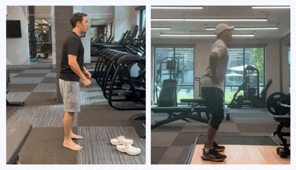
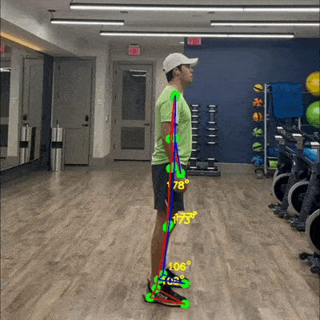

# Mastering the Vertical Jump

The countermovement jump (CMJ) is a cornerstone assessment in sports science, offering deep insights into athletic performance, injury risk, and recovery progress. To get the most out of CMJ testing, it’s essential to follow proper protocols for recording and analyzing jumps. This guide provides a step-by-step breakdown to ensure accuracy and reliability in your vertical jump analysis.

#### Setting the Foundation for Accurate CMJ Analysis

To accurately evaluate jump height, flight time, power, and technique, preparation is key. Here’s how to set up for success:\
**1. Environment Preparation**

* Choose a flat, non-slip surface with bright, even lighting. Avoid shadows and glare.
* Ensure the background contrasts with the athlete’s clothing, which should be form-fitting.
* Keep the recording area as clear as possible. Avoid moving objects, other people, or images of people on walls, as these can interfere with accurate motion analysis. A clean background helps ensure the best results.

<figure><figcaption></figcaption></figure>

**2. Camera Setup**

* Use a phone or camera mounted on a stable tripod.
* Position the camera approximately 3.3 feet from the floor and 6.5 to 9.8 feet from the athlete’s side.
* Ensure the entire athlete is visible in the frame throughout the jump. The camera should be vertical, and digital or optical zoom should not be used (scale = 1.0).
* Record in at least 1080p resolution at 60 frames per second (FPS) for the best quality. FPS refers to how many frames are captured per second—higher FPS results in smoother motion. Most smartphones default to 30 FPS, which will still work if 60 FPS is unavailable.

<figure><figcaption></figcaption></figure>

#### Executing the Perfect Jump

**3. Jump Analysis: Up to 5 Jumps**\
Our system can analyze up to five jumps, either individually or in sequence. This enables a more detailed assessment of jump performance, helping to identify consistency, technique improvements, and potential imbalances.

* **Arm-Swing:** If using an arm swing, ensure it is used consistently across all jumps, as it can increase jump height by up to 10%. For controlled testing, we recommend athletes place their hands on their hips to maintain consistency and eliminate variations in technique.
* **Countermovement Depth:** Maintain a consistent depth for all jumps, such as lowering until the thighs are parallel to the ground. Research shows that deeper countermovements (e.g., 90° knee flexion) can increase jump height by up to 17%.
* **During Flight:** Achieve full extension of the hips, knees, and ankles. Avoid bending the legs to artificially increase flight time.
* **Landing:** Land naturally as you would in a regular jump to allow for accurate assessment of ground reaction forces (GRF) and potential injury risk. Avoid artificially controlling the landing, as this can alter key impact measurements. Ensure consistency across all jumps.

<figure><figcaption></figcaption></figure>

**4. Recording and Testing**\
\
Perform 3–5 jumps in succession to calculate average metrics. A brief pause between jumps is fine; the analysis will still work. Record each jump from setup to landing, maintaining consistent technique and effort.

<figure><figcaption></figcaption></figure>

#### Common Recording Issues & Tips

**Incorrect Angle:** Use a side-on view with the athlete fully visible.\
**Poor Lighting:** Ensure even lighting, minimizing shadows.\
**Unstable Camera:** Use a tripod to keep the recording steady.\
**Obstructions:** Keep the athlete in clear view, free of blockages.\
**Unnecessary Footage:** Avoid recording walking to and from the test area—trim if needed. Use assisted recording or a timer for self-recording before jumping.

<figure><figcaption></figcaption></figure>

