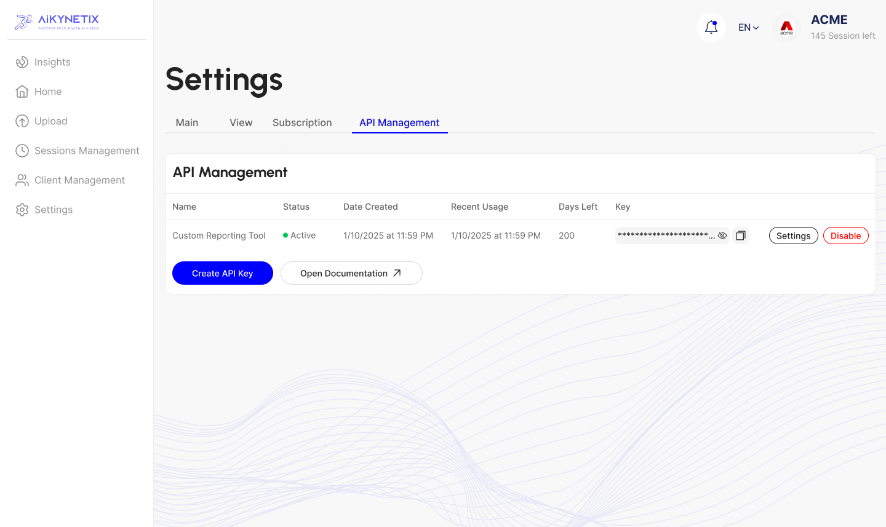

# API Key Creation & Management

### Step 1: Log into Your Dashboard

* **Access the Login Page:**\
  Go to [https://aikynetix.app/login](https://aikynetix.app/login) and sign in with your credentials.\
  &#xNAN;_(If you don’t have an account yet, please sign up first.)_

### Step 2: Open Your Settings

* **Navigate to Settings:**\
  Once logged in, click on your profile icon in the top-right corner of your dashboard.\
  Then, select **Settings** from the dropdown menu.

### Step 3: Go to API Management

* **Access the API Management Tab:**\
  Inside the Settings page, locate the **API Management** tab. This section is dedicated to creating and managing your API keys.

<figure><figcaption></figcaption></figure>

### Step 4: Create a New API Key

* **Fill Out the API Key Form:**\
  In the API Management section, click on the **Create API Key** button.\
  Complete the form with the following details:
  * **Key Name:** Enter a descriptive name (e.g., "Production Key" or "Dev Key").
  * **Domain:** Specify the domain where you plan to use this key.
  * **Description (Optional):** Add any additional notes about the key’s intended purpose.
* **Submit Your Request:**\
  Click **Submit** to generate your new API key.

<figure><figcaption></figcaption></figure>

### Step 5: Copy and Secure Your API Key

* **View Your API Key:**\
  After submission, your new API key will be displayed on the screen.\
  **Important:** Copy the key immediately and store it securely. For security reasons, you won’t be able to view the full key again later.
* **Using Your API Key:**\
  Include this key in your API requests by setting the Authorization header as follows:\
  `Authorization: API-KEY <your_api_key>`

### Step 6: Manage the key(s)

* **View Your API Key and manage it as you want.**

<figure><figcaption></figcaption></figure>

### More Information

For detailed instructions on managing, disabling, or deleting your API key, please check out our [API Key Management](./) section.
